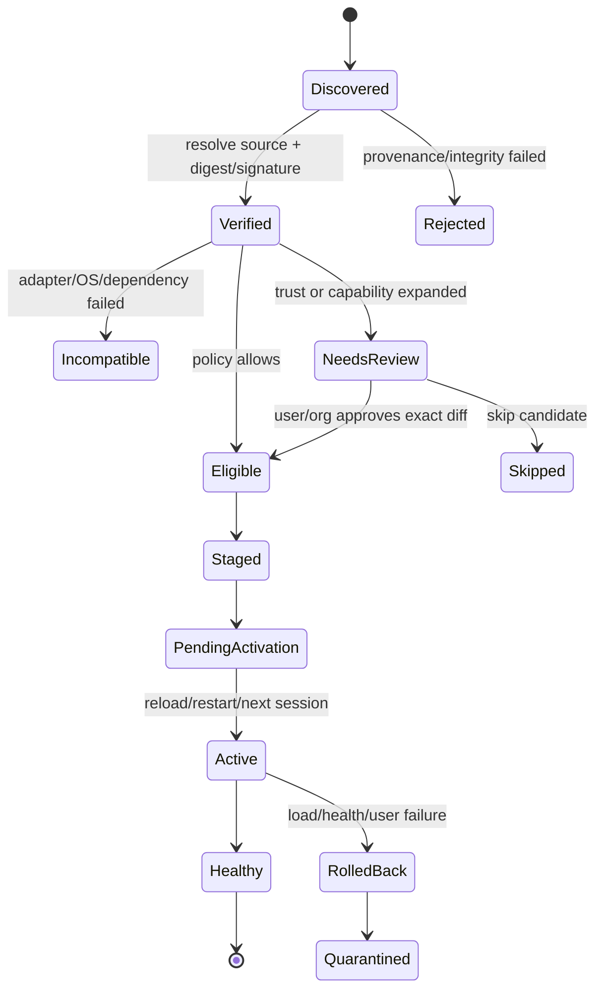

# AI Agent Skills 頻繁更新提醒：市場機制與統一方案

> 調研日期：2026-08-28
> 範圍：Codex、Claude Code、GitHub Copilot、Gemini CLI、Cursor、OpenCode、VS Code Agent Plugins，以及跨 Agent Skills 管理器。
> 證據口徑：只採用廠商官方文檔、官方規範和官方源碼。普通瀏覽器/IDE 擴展僅作極少量 UX 旁證，不作為方案主體。

## 結論先行

市場上還沒有一套同時覆蓋「跨 Agent 安裝、可靠版本識別、權限差異、低打擾提醒、自動更新、回滾」的完整 Skills 更新系統。現有成熟能力分散在不同產品中：

- Claude Code 的插件自動更新最完整：按 marketplace 區分默認策略，啟動後延遲檢查，更新寫盤但不熱替換當前會話，並用一次 reload 提醒完成激活。
- GitHub `gh skill` 是目前最接近「跨 Agent Skill 更新控制面」的官方工具：覆蓋多種宿主，具備來源追蹤、目錄樹 SHA、固定版本、安裝前 preview、dry-run 和交互確認。
- Gemini CLI Extensions 有逐擴展 opt-in 自動更新、手動更新、預發布選擇和重啟後生效。
- VS Code Agent Plugins 給出了很實用的邊界：官方/受控來源可以自動檢查，npm/PyPI 等外部命令來源只提示、再確認安裝。
- Vercel Labs `skills` 覆蓋大量 Agent 目錄，是較強的跨 Agent 安裝適配層，但更新仍是用戶主動運行命令，缺少後臺提醒、權限 diff 和回滾體驗。
- Codex、Cursor、OpenCode 對 Skills 的發現和使用已有官方文檔，但公開文檔沒有形成完整的「已安裝遠程 Skill 更新提醒」閉環。

因此推薦建設一個獨立於各 Agent 的 **Skill Update Control Plane（技能更新控制面）**：一份規範化 release/lock 狀態，一次檢查和風險評估，一條聚合提醒，再由 Codex、Claude、Copilot、Gemini、Cursor、OpenCode adapter 分發到各自目錄或調用原生更新能力。不要讓六個 Agent 對同一個 Skill 各自檢查、各自彈一次。

以下段落使用兩個標籤：

- **來源事實**：官方資料直接支持。
- **綜合推斷**：基於多家機制提煉的產品/架構建議，不表示任何一家已經完整實現。

## 1. 先定義對象：Skill 不是「無代碼的小插件」

**來源事實。** Agent Skills 開放規範把 Skill 定義為至少包含 `SKILL.md` 的目錄，還可包含可執行的 `scripts/`、按需讀取的 `references/` 和 `assets/`。規範 frontmatter 強制欄位只有 `name`、`description`；`compatibility` 是自由文本，`metadata` 是字符串鍵值映射，`allowed-tools` 仍是實驗欄位。規範沒有強制的版本號、發布通道、內容摘要、籤名、結構化權限或更新協議。[Agent Skills Specification](https://agentskills.io/specification)

**綜合推斷。** 更新系統不能只比較 `version: 1.2.3`，也不能把「只改 Markdown」默認視為無風險。Skill 的說明本身會改變 Agent 行為，腳本還可能直接執行；因此候選更新至少要比較：來源身份、內容摘要、指令變化、可執行內容、工具/網絡/文件/命令能力、依賴和宿主兼容性。

## 2. 市場對比矩陣

表中「未見公開機制」表示本次查閱的官方材料沒有給出該能力，不等於廠商內部一定不存在。

| 生態/工具 | 對象與更新觸發 | 版本、來源與完整性 | 提醒與生效 | 用戶控制 | 官方證據與主要缺口 |
|---|---|---|---|---|---|
| Claude Code | Plugin；啟用自動更新後，啟動後在後臺檢查，並隨機延遲 0–10 分鐘 | 版本依次可來自 `plugin.json`、marketplace、Git commit SHA 或 archive SHA256；archive 可聲明並校驗 SHA256 | 更新寫入磁碟，但當前會話繼續使用舊版本；只提示一次 `/reload-plugins`，也可下次啟動生效 | 官方 marketplace 默認自動，第三方/本地默認關閉；可逐 marketplace 切換；環境變量可全局關閉或強制 | [自動更新](https://code.claude.com/docs/en/discover-plugins#configure-auto-updates)、[版本管理](https://code.claude.com/docs/en/plugins-reference#version-management)、[marketplace 完整性與發布通道](https://code.claude.com/docs/en/plugin-marketplaces)。缺口：公開文檔未給出 snooze、skip-this-version 和可操作 rollback |
| GitHub Copilot CLI Plugins | First-party marketplace 在受信工作目錄的每次會話開始時更新；第三方 marketplace 僅在 `autoUpdate: true` 時更新；也可手動 update | Git 來源可固定精確 SHA；插件清單有嚴格 schema | `/plugin` 顯示更新狀態；CLI 支持更新單個或全部插件 | marketplace 級自動更新；組織可通過 managed configuration 約束 | [Copilot CLI plugin update options](https://docs.github.com/en/copilot/reference/copilot-cli-reference/cli-plugin-reference#copilot-plugins-update-options)。缺口：未見權限 diff、snooze、按版本跳過和 rollback 的公開說明 |
| GitHub `gh skill` | 獨立 Skills；掃描 Copilot、Claude、Cursor、Codex、Gemini、OpenCode 等已知宿主目錄；`gh skill update` 手動檢查單個或全部 | 安裝時把 source/ref/tree SHA 寫入 `SKILL.md` provenance；更新比較本地 tree SHA 與遠端；可固定 tag/SHA 或 `--pin` | `preview` 可在安裝前瀏覽 `SKILL.md`、scripts/references；更新交互模式列出候選再確認；`--dry-run` 只報告 | pinned Skill 被跳過；可 `--unpin`；`--force` 覆蓋本地修改 | [添加與更新 Skills](https://docs.github.com/en/copilot/how-tos/copilot-on-github/customize-copilot/customize-cloud-agent/add-skills)、[`gh skill update`](https://cli.github.com/manual/gh_skill_update)、[`gh skill preview`](https://cli.github.com/manual/gh_skill_preview)。目前最接近成熟跨 Agent 更新骨架；缺口是後臺 cadence、聚合提醒、籤名、兼容門和 rollback |
| Gemini CLI Extensions / Skills | Extension 可包含 agent skills；安裝時 `--auto-update` 逐擴展 opt-in，也可 update 單個/全部。獨立 Skill 可從 Git/本地安裝，但公開 CLI 文檔未見 `gemini skills update` | `gemini-extension.json` 有 `name/version`；Git 來源可指定 ref；支持 `--pre-release`；`migratedTo` 可遷移更新源。獨立 `SKILL.md` 無強制 version | Extension 管理變化在 CLI 重啟後生效；獨立 Skill 上遊提醒未見公開機制 | 安裝 Extension 時可選自動更新、預發布；可啟用/禁用擴展；企業安全配置可限制 Git 擴展 | [Gemini CLI extension reference](https://github.com/google-gemini/gemini-cli/blob/main/docs/extensions/reference.md)、[Managing Agent Skills](https://github.com/google-gemini/gemini-cli/blob/main/docs/cli/using-agent-skills.md)、[安全配置](https://github.com/google-gemini/gemini-cli/blob/main/docs/reference/configuration.md)。缺口：公開文檔未說明提醒節流、權限 diff、完整性摘要和 rollback UX |
| VS Code Agent Plugins | Agent Plugin；自動更新開啟時約每 24 小時檢查，也可手動檢查 | marketplace 安裝有信任確認；插件可能包含 hooks/MCP；npm/PyPI 外部來源不自動更新 | marketplace 更新可自動；外部來源只顯示 Update，點擊後仍需確認才運行安裝命令 | 全局更新策略和插件管理入口；可啟用、禁用、卸載 | [VS Code Agent plugins](https://code.visualstudio.com/docs/agent-customization/agent-plugins)。優勢是明確區分「受控包」和「外部安裝命令」 |
| Codex / ChatGPT Plugins | Plugin 是 skills/connectors 的安裝包；公開商店發布時，Skill 是提交時快照；修改後需重新掃描、審閱並提交新版本 | plugin manifest 可聲明版本和精確 Git/NPM 來源；提交鏈路會掃描和審核 Skill | 官方公開資料描述了發布與審核，但未建立本地已安裝 Skill 的自動檢查 cadence/提醒節流 | 發布者提交 release notes，審核後選擇發布；連接服務與授權權限分開 | [Skills & Plugins](https://developers.openai.com/codex/skills-and-plugins)、[打包 Plugin](https://developers.openai.com/plugins/build/plugins)、[提交與發布](https://developers.openai.com/plugins/deploy/submission)。缺口：客戶端更新提醒、permission diff 和自助 rollback 未見公開約定 |
| OpenAI Hosted Skills API | 服務端 Skill 版本對象 | 版本不可變，並有 default/latest 指向 | API 原語，不是本地 Codex Skill 更新提醒 UI | 調用方選擇版本 | [OpenAI Skills API](https://developers.openai.com/api/reference/resources/skills)。可借鑑不可變版本，但不能當作 Codex 本地更新機制的證據 |
| Cursor | 啟動時發現本地/插件 Skill；UI 支持從 GitHub 導入。公共 Marketplace 的首次發布和每次更新都人工審核；團隊 Marketplace 可跟蹤分支並在 push 後最多約 10 分鐘內 re-index | Skills 可含腳本、引用和資產；Marketplace 審核是發布側 gate，不等同於客戶端籤名 | 可在 Customize > Skills 查看；團隊 re-index cadence 不能推斷成客戶端每 10 分鐘檢查 | 團隊發布有 Default Off、Default On、Required | [Cursor Agent Skills](https://cursor.com/docs/skills)、[Plugins](https://cursor.com/docs/plugins)、[Marketplace security](https://cursor.com/help/security-and-privacy/marketplace-security)、[Plugin help](https://cursor.com/help/customization/plugins)。缺口：Skills 文檔未說明 installed-vs-latest 提醒、固定版本、校驗、diff 或回滾 |
| OpenCode | 從項目、用戶以及 Claude/`.agents` 兼容目錄發現 `SKILL.md`；V2 另支持本地目錄和 HTTP catalog | 穩定版接受 `compatibility`、`metadata`；V2 catalog 有 opaque `version` 和文件列表，但無 checksum/signature；V2 明確 portability 欄位不執行兼容門 | 原生 `skill` 工具按需加載；V2 catalog 可刷新緩存 | 可對 Skill 工具設權限或禁用 | [OpenCode Agent Skills](https://opencode.ai/docs/skills)、[OpenCode V2 Skills](https://opencode.ai/v2/docs/skills/)。缺口：穩定版未見 provenance/更新提醒；V2 也未見 pin、diff、籤名、確認或回滾。`autoupdate: "notify"` 是 OpenCode 主程序更新，不是 Skill 更新 |
| Vercel Labs `skills` | 跨 Agent CLI；`npx skills update` 手動更新 project/global/specific Skills；推薦一份 canonical copy 再連結到多個宿主 | lock v3 記錄 `skillFolderHash`/`skillPath`；GitHub 來源比較最新目錄 tree SHA，well-known 來源比較 digest | 命令發現變化後直接用內部 `add -y` 重新安裝；沒有官方後臺 reminder 服務 | 支持 scope 和指定 Skill；無法自動檢查的來源會報告原因 | [Vercel Labs skills](https://github.com/vercel-labs/skills)、[項目架構與 lock 欄位](https://github.com/vercel-labs/skills/blob/main/AGENTS.md)、[更新實現](https://github.com/vercel-labs/skills/blob/main/src/update.ts)。關鍵邊界：源碼把 `check`、`update`、`upgrade` 路由到同一更新流程，`check` 不是只讀 dry-run；優勢是宿主覆蓋廣，缺口是安全 diff、逐項確認、按版本抑制和 rollback |
| Agent Plugins 開放規範 | 定義可攜帶 Skills、MCP、hooks 等的跨 Agent Plugin 格式 | `$schema` 是機器可判定的格式兼容門；可選 `version` 推薦 SemVer | 安裝、分發、啟用、更新和 UI 被明確劃為 client-managed | 由各客戶端自行實現 | [Agent Plugins Specification](https://agent-plugins.org/specification)、[Plugin package boundary](https://agent-plugins.org/plugin-authors/build-an-agent-plugin)。說明市場為什麼仍需要統一更新控制面：規範沒有統一籤名、checksum、提醒或回滾協議 |

## 3. 從現有產品中可復用的成熟模式

### 3.1 檢查、下載、安裝、激活、提醒必須解耦

**來源事實。** Claude Code 會在啟動後延遲檢查，更新落盤但當前會話不切換，只給一次 reload 提醒；Gemini CLI 的擴展變化也要重啟會話才生效；VS Code Agent Plugins 則把自動檢查與外部安裝命令的顯式確認分開。來源見上表。

**綜合推斷。** 用五個獨立時間點建模：

1. `checked_at`：何時查詢遠端。
2. `staged_at`：何時下載到隔離區並完成校驗。
3. `approved_at`：自動策略或用戶何時批准。
4. `activated_at`：何時對新會話/宿主生效。
5. `notified_at`：何時真正打擾用戶。

檢查頻繁不等於提醒頻繁。後臺每天檢查一次完全可以只在每周摘要裡提醒一次。

### 3.2 來源信任決定默認策略

**來源事實。** Claude Code 對官方 marketplace 默認開啟自動更新，對第三方/本地 marketplace 默認關閉；Copilot CLI 對 first-party marketplace 在會話啟動時更新，而第三方需顯式 `autoUpdate: true`；VS Code Agent Plugins 的 npm/PyPI 外部來源永不自動更新，需要用戶確認命令。[Claude 自動更新](https://code.claude.com/docs/en/discover-plugins#configure-auto-updates)、[Copilot 更新選項](https://docs.github.com/en/copilot/reference/copilot-cli-reference/cli-plugin-reference#copilot-plugins-update-options)、[VS Code Agent Plugins](https://code.visualstudio.com/docs/agent-customization/agent-plugins)

**綜合推斷。** 默認策略不應只按 semver major/minor/patch 判斷，應先按 `source_trust`：

- `official-managed`：可允許低風險更新自動 staged/activated。
- `verified-publisher`：用戶 opt-in 後才自動。
- `community-git`：默認 Prompt。
- `local/path/external-command`：默認 Manual；更新源或命令變化必須重新確認。

### 3.3 不可變身份比版本字符串可靠

**來源事實。** Claude 的版本解析可落到 Git commit SHA 或 archive SHA256；`gh skill` 用目錄 tree SHA 判斷遠端是否改變；Vercel Labs `skills` 也用 `skillFolderHash`/digest；OpenAI Hosted Skills 的版本對象不可變。[Claude 版本管理](https://code.claude.com/docs/en/plugins-reference#version-management)、[`gh skill update`](https://cli.github.com/manual/gh_skill_update)、[Vercel update source](https://github.com/vercel-labs/skills/blob/main/src/update.ts)、[OpenAI Skills API](https://developers.openai.com/api/reference/resources/skills)

**綜合推斷。** `version` 用於人類理解和兼容策略；真正的安裝身份必須是不可變的 `resolved.commit_sha`、`resolved.tree_sha` 或 `resolved.content_sha256`。校驗和證明「下載內容與聲明一致」，但不證明發布者可信，二者不可混為一談。

### 3.4 固定版本、通道和依賴約束是穩定性工具

**來源事實。** `gh skill` 支持指定 tag/SHA 與 pin；Claude marketplace 可通過不同 ref/marketplace 表達 stable/latest 等通道，插件依賴可用 semver 約束，自動更新時解析滿足約束的最高版本；Gemini CLI 有 `--pre-release`。[GitHub Skills](https://docs.github.com/en/copilot/how-tos/copilot-on-github/customize-copilot/customize-cloud-agent/add-skills)、[Claude 發布通道](https://code.claude.com/docs/en/plugin-marketplaces#version-resolution-and-release-channels)、[Claude 依賴](https://code.claude.com/docs/en/plugin-dependencies)、[Gemini Extension reference](https://github.com/google-gemini/gemini-cli/blob/main/docs/extensions/reference.md)

**綜合推斷。** 用戶設置應同時支持：`channel = stable|beta|nightly`、`constraint = ^1.4`、`pin = immutable digest`。Pin 是「明確保持現狀」，Skip 是「只忽略這個候選版本」，Snooze 是「稍後提醒」；三者語義必須分開。

### 3.5 當前會話不熱替換

**來源事實。** Claude Code 和 Gemini CLI 都把擴展更新推遲到 reload/restart/下一會話生效。來源見上表。

**綜合推斷。** Agent 會話已經加載了 Skill 名稱、描述乃至正文，半途中熱替換會造成同一任務前後規則不一致。默認應在會話邊界原子切換；只有純靜態資產且宿主明確支持時才考慮熱刷新。

### 3.6 高風險變化需要重新同意

**來源事實。** Claude marketplace 的命令來源和 `headersHelper` 等高風險配置變更需要精確批准；無同意的後臺更新會被跳過並進入錯誤狀態。Skill/Plugin 本身可能以用戶權限執行代碼，官方要求只安裝可信來源。[Claude marketplace command sources](https://code.claude.com/docs/en/plugin-marketplaces)、[Claude plugin security](https://code.claude.com/docs/en/discover-plugins#security)

GitHub 同樣明確警告，Agent Skills 並不由 GitHub 驗證，可能包含 prompt injection、隱藏指令或惡意腳本，建議安裝前先 preview；這也是獨立 Skills 不應默認無感更新的重要事實基礎。[GitHub: Add and update Agent Skills](https://docs.github.com/en/copilot/how-tos/copilot-on-github/customize-copilot/customize-cloud-agent/add-skills)、[`gh skill preview`](https://cli.github.com/manual/gh_skill_preview)

**綜合推斷。** 需要批准的邊界應是「能力或信任發生變化」，而不是「版本號變化」：新增腳本/hooks/MCP、擴大網絡/文件/命令/secret 權限、更換發布者或源、改變安裝命令、降低宿主兼容置信度，都應暫停自動更新並展示 diff。

### 3.7 `check`、`preview`、`apply` 必須是不同操作

**來源事實。** `gh skill preview` 可以不安裝就查看 Skill 文件和內容，`gh skill update --dry-run` 只報告候選，交互更新先列出再確認。相反，Vercel Labs `skills` 當前源碼把 `check`、`update`、`upgrade` 都路由到同一 `runUpdate`，發現變化後會重新安裝，只有上遊刪除另行確認。[`gh skill preview`](https://cli.github.com/manual/gh_skill_preview)、[`gh skill update`](https://cli.github.com/manual/gh_skill_update)、[Vercel CLI routing](https://github.com/vercel-labs/skills/blob/main/src/cli.ts)、[Vercel update implementation](https://github.com/vercel-labs/skills/blob/main/src/update.ts)

**綜合推斷。** 更新控制面的 API 和 UI 必須嚴格區分：

- `check`：只取元數據、解析 candidate，不寫宿主目錄。
- `preview/diff`：可下載到隔離緩存，但不激活。
- `stage`：驗證後準備不可變內容。
- `apply/activate`：明確改變宿主狀態。

任何名為 check/dry-run 的入口都不能產生安裝副作用，這是自動提醒服務可被用戶信任的前提。

## 4. 推薦架構：一個控制面，多個 Agent Adapter

```text
Registries / Git / Archives / Local sources
                    │
          Resolver + Provenance verifier
                    │
       Candidate diff + Risk classifier
                    │
     Policy engine + Reminder scheduler
                    │
      Content-addressed staging store
                    │
    ┌────────┬────────┬────────┬────────┐
  Codex    Claude   Copilot   Gemini  Cursor/OpenCode
 adapter   adapter   adapter   adapter      adapters
    └────────┴────────┴────────┴────────┘
                    │
        Activation / health / rollback log
```

**綜合推斷。** 同一個 canonical Skill 被多個 Agent 使用時，只生成一個候選、一次安全評估、一個提醒事件；adapter 只負責宿主路徑、manifest 轉換、reload/restart 和原生命令調用。內容保存在 content-addressed store，宿主目錄使用原子複製或連結到當前版本，避免六份內容漂移。

### 4.1 三類數據必須分開

1. **Publisher release（發布者聲明，不可變）**：版本、來源、摘要、通道、兼容性、權限、依賴、變更說明、籤名。
2. **Installation lock（解析結果，不可變歷史）**：最終 commit/tree/content SHA、安裝時間、adapter 目標、previous/LKG。
3. **User policy & reminder state（用戶本地可變）**：Auto/Prompt/Manual、pin、snooze、skip-version、已批准權限、上次提醒時間。

不要把 `snoozed_until` 寫進發布者 manifest，也不要讓發布者覆蓋用戶已批准權限。

### 4.2 推薦統一 release manifest

為保持 Agent Skills 兼容，繼續把 `SKILL.md` 作為運行時入口；新增 sidecar `skill-release.json`，或由 registry 在服務端提供同構記錄。Agent Skills 的 `metadata` 僅是字符串映射，不適合承載複雜權限和宿主矩陣。[Agent Skills Specification](https://agentskills.io/specification) Agent Plugins 的 `$schema` 已證明「宿主不支持 schema 就拒絕」是一條可機器執行的格式兼容邊界，但其 update 生命周期仍由客戶端管理；本方案沿用 schema gate，再補 host capability matrix。[Agent Plugins Specification](https://agent-plugins.org/specification)

```json
{
  "schema": "skill-release/v1",
  "id": "com.example/pdf-review",
  "name": "pdf-review",
  "version": "2.3.1",
  "channel": "stable",
  "publisher": { "id": "example", "keyId": "sigstore:key-123" },
  "source": {
    "type": "git",
    "url": "https://github.com/example/skills",
    "ref": "v2.3.1",
    "subdir": "skills/pdf-review"
  },
  "resolved": {
    "commitSha": "...",
    "treeSha": "...",
    "contentSha256": "..."
  },
  "compatibility": {
    "manager": ">=1.2.0",
    "agents": {
      "codex": ">=2026.8",
      "claude-code": ">=2.1",
      "copilot-cli": "*",
      "gemini-cli": ">=0.8",
      "cursor": "*",
      "opencode": "*"
    },
    "os": ["darwin", "linux", "win32"]
  },
  "components": {
    "instructions": true,
    "scripts": ["scripts/extract.py"],
    "hooks": [],
    "mcpServers": []
  },
  "permissions": {
    "tools": ["shell:python"],
    "filesystem": ["read:user-selected"],
    "network": ["api.example.com:443"],
    "secrets": [],
    "commands": ["python scripts/extract.py"]
  },
  "dependencies": { "skills": { "base-review": "^1.4" } },
  "release": {
    "publishedAt": "2026-08-28T00:00:00Z",
    "severity": "normal",
    "breaking": false,
    "notesUrl": "https://example.com/releases/2.3.1"
  },
  "signatures": [{ "type": "sigstore", "bundle": "..." }]
}
```

manifest 必須通過 canonical JSON 計算摘要；`resolved` 欄位由 resolver 鎖定後寫入 lock，不能盲信遠端自報。結構化 permissions 是更新評審用的「能力意圖」，不替代宿主運行時 sandbox/approval。

### 4.3 推薦 lock 與提醒狀態

```json
{
  "skillId": "com.example/pdf-review",
  "installed": {
    "version": "2.3.0",
    "contentSha256": "old...",
    "sourceIdentity": "git:https://github.com/example/skills#skills/pdf-review",
    "activatedAt": "2026-08-01T09:00:00Z"
  },
  "candidate": {
    "version": "2.3.1",
    "contentSha256": "new...",
    "risk": "R1",
    "compatibility": "pass",
    "permissionDiff": { "added": [], "removed": [] }
  },
  "policy": {
    "mode": "prompt",
    "channel": "stable",
    "constraint": "^2.3",
    "pin": null
  },
  "reminder": {
    "eventKey": "com.example/pdf-review@new...",
    "lastNotifiedAt": null,
    "snoozedUntil": null,
    "skippedCandidate": null
  },
  "activation": {
    "previousContentSha256": "older...",
    "lastKnownGoodContentSha256": "old...",
    "targets": ["codex", "claude-code", "cursor"]
  }
}
```

`eventKey = skill_id + target_digest` 是去重核心：同一候選無論檢查多少次都只累計一條 inbox 事件；新 digest 到來會自動解除舊版本的 skip，但不會解除 pin。

### 4.4 狀態機



每個狀態變化寫入審計日誌；`Rejected`、`Incompatible`、`Quarantined` 不能被普通自動更新策略繞過。

## 5. 風險分級與默認動作

| 等級 | 典型條件 | 默認更新動作 | 默認提醒 |
|---|---|---|---|
| R0 可信低風險 | 官方/已驗證發布者；籤名與 digest 有效；同源同通道；無權限、腳本、hook、MCP、依賴或兼容變化；用戶已 opt-in 自動更新 | 24 小時冷靜期後 staged，在下一會話原子激活 | 靜默寫入 Recent updates；周摘要可見 |
| R1 普通變化 | 指令/資產/常規功能變化；無新增特權能力；兼容通過 | Prompt 模式待用戶批量更新；Auto 模式可 staged | 導航 badge + 更新收件箱；每日或每周摘要，不彈模態 |
| R2 高風險變化 | 新增/改變腳本、hooks、MCP、安裝命令、網絡/文件/secret 權限；換源/換發布者/換通道；兼容未知；本地副本已修改 | 阻斷自動更新，要求批准精確 diff | 安靜但持久的 badge；用戶進入管理頁時展示確認面板 |
| R3 安全事件 | 已知惡意、籤名撤銷、嚴重漏洞、來源劫持 | 立即 quarantine/禁用；有可信修復時按組織策略強制更新 | 高優先級通知，說明採取了什麼動作、影響、審計與恢復入口 |

**綜合推斷。** 即使是 R0，也只有用戶或組織事先允許該信任域自動更新時才能靜默。Skill 的指令變化具有供應鏈風險，不建議對任意社區 Git 倉庫默認自動更新。

## 6. 頻繁更新時的低打擾提醒設計

### 6.1 檢查 cadence

**來源事實。** VS Code Agent Plugins 提供了每 24 小時的明確行業錨點；Claude Code 使用啟動後 0–10 分鐘隨機延遲，避免所有實例同時請求。[VS Code Agent Plugins](https://code.visualstudio.com/docs/agent-customization/agent-plugins)、[Claude 自動更新](https://code.claude.com/docs/en/discover-plugins#configure-auto-updates)

**綜合推斷。** 推薦默認：

- 後臺：每 24 小時一次，加基於設備 ID 的確定性 ±20% jitter。
- 用戶打開 Skills/Plugins 管理頁：若緩存超過 15 分鐘，立即刷新。
- 手動「檢查更新」：立即檢查，支持 dry-run。
- 網絡錯誤：指數退避，最多 7 天；不要把失敗當成「沒有更新」。
- 安全撤銷：獨立 advisory 通道或更短 TTL，不等待普通輪詢。
- 使用 ETag/If-None-Match、Git tree SHA 或 registry delta cursor，避免頻繁下載完整 Skill。

### 6.2 提醒層級

1. **事件日誌**：所有檢查、staging、成功、失敗、回滾都進入 Recent updates。
2. **導航 badge**：顯示需要人處理的候選數，不顯示已靜默完成數。
3. **更新收件箱**：按 Skill 聚合，展示當前→目標、來源、發布者、diff、兼容、是否需 reload、回滾入口。
4. **摘要**：默認每天一次或每周一次，合併「可更新、成功、失敗」。
5. **強交互**：只用於 R2 用戶正主動更新時，或 R3 安全阻斷；不要在 Agent 正執行任務時突然彈窗。

### 6.3 去重、延後與跳過

- 同一個 `eventKey` 最多生成一條 inbox 項；再次檢查只刷新時間和嚴重度。
- `Snooze 1/3/7 days` 只改變下次提醒時間，不改變候選與安全狀態。
- `Skip this version` 綁定不可變 target digest；新候選出現後重新提醒。
- `Pin` 綁定約束或 digest，直到用戶顯式 unpin；安全撤銷仍可提示。
- 多 Agent adapter 失敗只在同一條 Skill 事件裡展開為 target 子狀態，不生成六條通知。

**證據邊界。** Pin/dry-run 在 `gh skill` 中有官方實現；「Snooze」和「Skip this version」在本次查閱的主流 Agent Skills 官方機制中未形成共同標準，屬於本方案為高頻更新補齊的產品能力。

### 6.4 一條合格的提醒至少顯示

- `pdf-review 2.3.0 → 2.3.1`，以及 immutable target digest。
- 來源與發布者是否變化、籤名/完整性狀態。
- 變更摘要，並把 `SKILL.md` 指令、scripts、hooks、MCP、依賴分欄。
- 權限 diff：新增、收窄、移除。
- 各目標 Agent 的兼容狀態與生效方式。
- 「更新全部低風險項」「查看差異」「稍後」「跳過此版本」「固定當前版本」。
- 更新後「恢復上一版本」及其數據兼容警告。

## 7. 各 Agent Adapter 設計

| Adapter | 優先策略 | 激活語義 | 特殊處理 |
|---|---|---|---|
| Codex | 對公開 Plugin 走原生 marketplace/審核版本；對 standalone/local Skill 由控制面維護 lock 和內容目錄 | 下一會話；宿主支持刷新時再顯式調用 | 不把 OpenAI Hosted Skills API 當成本地更新器；本地修改必須 dirty-check |
| Claude Code | marketplace Plugin 優先委託原生自動更新；控制面讀取/匯總 marketplace 錯誤和 reload 狀態；獨立 Skill 才走通用安裝 | `/reload-plugins` 或下一啟動 | 保留官方/第三方 marketplace 默認差異；高風險 command/source delta 不繞過原生同意 |
| GitHub Copilot | Plugin 走 Copilot 原生命令；獨立 Skill 可復用 `gh skill` provenance/pin/dry-run，或讀取同等 lock | 下一會話/宿主重載 | 避免同時讓 `gh skill` 與控制面更新同一目錄；明確唯一 owner |
| Gemini CLI | Extension 優先調用 `gemini extensions update`；純 Skill 可由 adapter 安裝到被發現目錄或封裝成 extension | 重啟 CLI/extension | 映射 pre-release/channel；尊重 Git extension 安全策略與 enable/disable |
| Cursor | adapter 管理 GitHub 導入或本地 Skill 的 provenance、digest 和原子替換 | 下一次啟動/重新發現 | 官方文檔沒有原生遠端更新協議，控制面應成為唯一更新 owner |
| OpenCode | 寫入 `.agents/skills` 或 OpenCode 專用目錄，並維護獨立 lock | 下一會話/重新掃描 | 保留 OpenCode 的 Skill tool 權限；frontmatter 未識別的更新欄位放 sidecar，不依賴宿主解析 |
| VS Code Agent Plugins | marketplace 來源儘量委託原生 24h 更新；npm/PyPI/外部命令仍保留顯式確認 | 按宿主 reload/restart | 不因統一控制面而繞過外部命令確認 |

Adapter 必須實現統一接口：

```ts
interface SkillHostAdapter {
  discover(): Promise<InstalledTarget[]>;
  validate(release: SkillRelease): Promise<CompatibilityResult>;
  stage(release: ResolvedRelease): Promise<StagedTarget>;
  activate(staged: StagedTarget, boundary: "reload" | "restart" | "next-session"): Promise<void>;
  healthCheck(target: InstalledTarget): Promise<HealthResult>;
  rollback(toDigest: string): Promise<void>;
}
```

## 8. 本地修改、依賴和回滾

### 8.1 本地修改

**來源事實。** `gh skill update --force` 可以覆蓋本地修改，但不會刪除額外本地文件；Vercel `skills` 的 update 實現會從 lock 中恢復來源並重新執行安裝。[`gh skill update`](https://cli.github.com/manual/gh_skill_update)、[Vercel update implementation](https://github.com/vercel-labs/skills/blob/main/src/update.ts)

**綜合推斷。** 自動更新前計算安裝基線與當前目錄的差異。若 dirty：

- 默認進入 R2，不覆蓋。
- 提供「保留當前並 fork 為 local Skill」「三方合併」「導出 patch 後替換」「放棄本地修改並更新」。
- 自動更新系統自己寫入的 adapter/lock 元數據不應被誤判為用戶修改。

### 8.2 依賴求解

依賴求解要先於提醒：如果 A 的新版本要求 B `^3`，而 B 被 pin 在 `2.x`，通知應是「一組不可滿足的更新」，而不是先提醒 A、更新後才報錯。Claude 的 semver 依賴約束是可復用先例。[Claude plugin dependencies](https://code.claude.com/docs/en/plugin-dependencies)

### 8.3 真正可用的回滾

**來源事實。** Claude 會把舊 plugin 版本緩存約 14 天，但公開文檔沒有把它描述為面向用戶的 downgrade/rollback 命令，不能把「有緩存」誤報成「已有回滾」。[Claude plugin caching](https://code.claude.com/docs/en/plugins-reference#plugin-caching-and-file-resolution)

**綜合推斷。** 每次激活前保留 `previous` 與 `lastKnownGood`：

- 內容目錄不可變，激活只是原子切換 `current` 指針。
- parse/load/adapter 部署失敗自動回滾。
- 用戶可在 Recent updates 中一鍵回滾。
- 回滾同時 quarantine 失敗 digest，直到用戶顯式重試或發布新 digest。
- 若 Skill 寫入了外部數據，release manifest 應聲明數據遷移和 `rollbackSafe`；否則只回滾 Skill 文件可能不安全。

## 9. 反模式

1. **每次檢查都彈窗。** 會把高頻發布直接變成通知疲勞。
2. **只比較 semver。** 發布者可復用版本號，Git 分支會移動；必須鎖不可變摘要。
3. **把 checksum 當成信任。** 它只能證明內容一致，不能證明來源善意。
4. **把「只改提示詞」視為無風險。** 指令變化可能引入 prompt injection、數據外傳或行為漂移。
5. **對所有第三方源默認自動更新。** 與 Claude、Copilot、VS Code Agent Plugins 的信任分層經驗相反。
6. **更新當前活躍會話。** 同一任務內出現兩套 Skill 規則，難以審計和復現。
7. **一個 Agent 一套提醒。** 同一 Skill 被六個宿主重複提醒，是跨 Agent 用戶最明顯的噪聲來源。
8. **靜默覆蓋本地修改。** 破壞用戶定製，且無法判斷新版本失敗還是本地 patch 失敗。
9. **失敗後繼續反覆嘗試並反覆提醒。** 應 quarantine 失敗 digest，並對事件去重。
10. **把緩存宣傳成回滾。** 沒有原子切換、狀態恢復、入口和審計的緩存不等於可用回滾。
11. **只寫 changelog，不展示能力 diff。** 用戶真正需要知道的是新增腳本、工具、網絡、secret、MCP 和來源變化。
12. **由管理器繞過宿主安全確認。** Adapter 必須保留 Claude 高風險來源同意、Gemini 企業策略、VS Code 外部命令確認等原生邊界。

## 10. 推薦落地路線

### MVP：先解決「知道有更新，但不騷擾，也不裝錯」

建議 4–6 周完成：

- 支持 Git/HTTPS archive/local 三類源，至少覆蓋 Codex、Claude、Cursor、OpenCode 的目錄 adapter。
- 建立 `skill-release.json`、lock v1、source identity、commit/tree/content SHA。
- 手動 `check --dry-run` 和每天一次後臺檢查；24h + jitter。
- 候選更新收件箱、導航 badge、按 `skill_id@digest` 去重。
- 展示 `SKILL.md`、scripts/hooks/MCP、來源和權限的結構化 diff。
- 默認模式：官方/驗證源 Prompt，社區 Git Prompt，本地 Manual；MVP 不做靜默自動激活。
- 下一會話原子激活，保留 previous，支持手動回滾。
- 檢測本地 dirty，禁止靜默覆蓋。

MVP 驗收指標：

- 同一候選在 30 天內最多產生 1 條活躍 inbox 事件。
- 六個 Agent 共用一個 Skill 時只生成 1 條用戶提醒。
- 100% 安裝都有不可變 digest 和來源記錄。
- R2 條件 100% 阻斷自動激活。
- adapter 安裝失敗不改變當前可用版本。

### V1：可信低風險自動更新

- 補齊 Gemini、Copilot、VS Code Agent Plugin adapter，並能委託原生 updater。
- Publisher key/signature、組織 allowlist、channel/constraint/pin。
- R0 自動 staged，下一會話激活；每日/每周摘要。
- 兼容矩陣、依賴求解、reload/restart 編排。
- 激活健康檢查、自動 rollback、失敗 digest quarantine。
- Snooze、Skip this version、Recent updates、審計導出。

### 進階：面向團隊和 marketplace

- Registry advisory/revocation 通道與強制 quarantine 策略。
- 灰度發布：1% → 5% → 25% → 100%，按加載失敗、rollback、用戶拒絕率自動暫停。
- 透明日誌、可驗證構建、籤名輪換、SBOM/腳本依賴掃描。
- 團隊策略：可信 publisher、自動更新窗口、最大版本跨度、凍結期、緊急例外。
- 多設備同步「策略」，但不跨設備複製 secret 或本地批准令牌。
- 語義評估：對高影響 Skill 在隔離樣例任務上跑回歸 eval，再進入 R0/R1。

## 11. 監控指標與防打擾預算

| 指標 | 目標方向 | 用途 |
|---|---|---|
| 每用戶每周主動提醒數 | 下降；建議普通更新 ≤ 1 個摘要 | 衡量打擾 |
| badge 打開率 / 更新執行率 | 上升 | 衡量提醒是否有用 |
| 發現到安全修復激活時間 | 下降 | 衡量安全時效 |
| 自動更新失敗率 | < 0.5% 起步目標 | 決定是否擴大 R0 |
| 更新後 24h rollback 率 | < 1% 起步目標 | 發現壞版本 |
| R2 誤放行率 | 0 | 安全紅線 |
| 重複事件率 | 0 | 驗證 eventKey 去重 |
| 多 Agent 重複提醒率 | 0 | 驗證控制面聚合 |
| 長期 stale 且有高危 advisory 的 Skill 數 | 下降並告警 | 避免 pin/skip 掩蓋風險 |

自動更新只有在來源可驗證、diff 可解釋、激活可回滾、失敗可觀測四項同時成立時才應擴大範圍。

## 12. 最終產品建議

推薦默認體驗是：**後臺每天檢查，平時不彈；一個更新中心聚合所有 Agent；可信且無能力擴張的更新可在用戶 opt-in 後於下一會話靜默生效；新增腳本、權限、MCP、來源或不兼容變化必須持久提醒並重新批准；任何更新都能看到來源、digest、diff、目標 Agent 和回滾入口。**

這套設計不是複製某一家，而是以 GitHub `gh skill` 的 provenance/pin/preview/dry-run/confirm 為控制面骨架，組合 Claude 的信任分層與會話邊界、Gemini 的逐擴展 auto-update 與 restart、VS Code Agent Plugins 的外部命令確認、Cursor 的 marketplace 更新覆審、Vercel `skills` 的 canonical copy 與跨 Agent adapter 思路，再補上當前市場普遍缺失的統一提醒狀態、權限 diff 和真正回滾。

## 官方來源索引

- [Agent Skills Specification](https://agentskills.io/specification)
- [OpenAI Skills & Plugins](https://developers.openai.com/codex/skills-and-plugins)
- [OpenAI: Package your plugin](https://developers.openai.com/plugins/build/plugins)
- [OpenAI: Submit plugins](https://developers.openai.com/plugins/deploy/submission)
- [OpenAI Skills API](https://developers.openai.com/api/reference/resources/skills)
- [Claude Code: Discover and install plugins](https://code.claude.com/docs/en/discover-plugins)
- [Claude Code: Plugins reference](https://code.claude.com/docs/en/plugins-reference)
- [Claude Code: Plugin marketplaces](https://code.claude.com/docs/en/plugin-marketplaces)
- [Claude Code: Plugin dependencies](https://code.claude.com/docs/en/plugin-dependencies)
- [GitHub Copilot CLI plugin reference](https://docs.github.com/en/copilot/reference/copilot-cli-reference/cli-plugin-reference)
- [GitHub: Add and update Agent Skills](https://docs.github.com/en/copilot/how-tos/copilot-on-github/customize-copilot/customize-cloud-agent/add-skills)
- [GitHub CLI: gh skill update](https://cli.github.com/manual/gh_skill_update)
- [GitHub CLI: gh skill preview](https://cli.github.com/manual/gh_skill_preview)
- [Gemini CLI extension reference](https://github.com/google-gemini/gemini-cli/blob/main/docs/extensions/reference.md)
- [Gemini CLI security/configuration](https://github.com/google-gemini/gemini-cli/blob/main/docs/reference/configuration.md)
- [VS Code Agent Plugins](https://code.visualstudio.com/docs/agent-customization/agent-plugins)
- [Cursor Agent Skills](https://cursor.com/docs/skills)
- [OpenCode Agent Skills](https://opencode.ai/docs/skills)
- [OpenCode V2 Agent Skills](https://opencode.ai/v2/docs/skills/)
- [Vercel Labs skills](https://github.com/vercel-labs/skills)
- [Vercel Labs skills update implementation](https://github.com/vercel-labs/skills/blob/main/src/update.ts)
- [Agent Plugins Specification](https://agent-plugins.org/specification)
